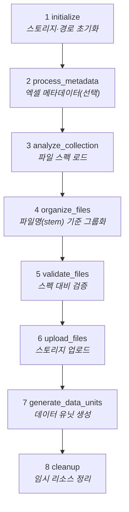
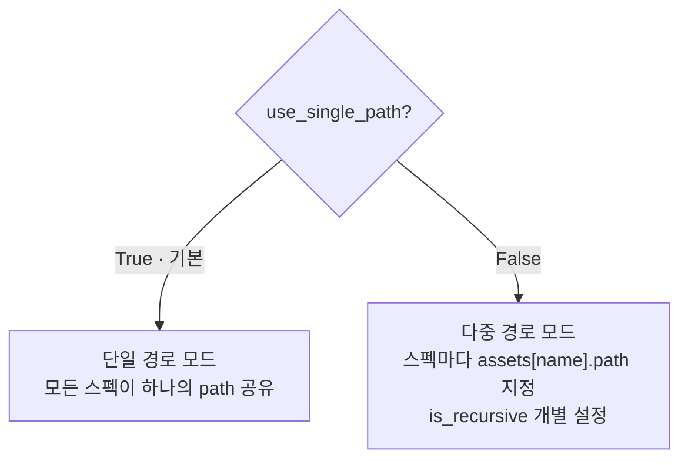
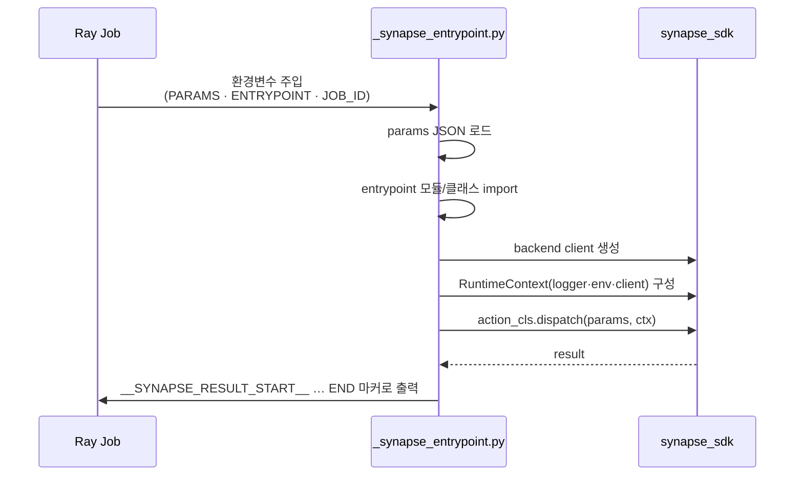

# dm-data-unit-uploader

외부 스토리지의 파일을 커스텀 변환 없이 Synapse 데이터 유닛으로 업로드하는 **기본형 범용 업로더**. 이미지·비디오·텍스트·PCD·오디오 등 다양한 데이터 타입을 지원합니다.

---

## 1. 플러그인 식별 정보

| 항목 | 값 |
| --- | --- |
| 폴더명 / GitHub 저장소 | `dm-data-unit-uploader` |
| 코드명 (`config.yaml` → `code`) | `dm-data-unit-uploader` |
| 플러그인 이름 (`config.yaml` → `name`) | `dm-data-unit-uploader` |
| 패키지명 (`pyproject.toml` → `name`) | `dm-data-unit-uploader-v2` |
| 버전 | `2.1.1` |
| 카테고리 | `upload` |
| 지원 데이터 타입 | `image`, `video`, `text`, `pcd`, `audio` |
| upload 진입점 | `plugin.upload.UploadAction` |

---

## 2. 개요

이 플러그인은 SDK의 `DefaultUploadAction`을 **거의 그대로** 사용하는 표준 업로더입니다. 포맷 변환·분할 같은 커스텀 단계를 삽입하지 않고, 기본 8단계만으로 파일을 조직화·검증·업로드합니다. 다른 변환형 플러그인(avi/tiff/pdf/video/coco)의 **기준(baseline)** 이 되는 형태입니다.

`setup_steps`를 재정의하지 않으므로 기본 단계가 그대로 실행되며, 커스터마이징이 필요하면 이 메서드를 오버라이드해 커스텀 단계를 등록할 수 있습니다.

---

## 3. 전체 업로드 워크플로우 (기본 8단계)



---

## 4. 경로 모드 (단일 / 다중)



### 단일 경로 모드 (`use_single_path=True`, 기본값)

```json
{
  "name": "Standard Upload",
  "path": "/data/experiment_1",
  "storage": 1,
  "data_collection": 5
}
```

### 다중 경로 모드 (`use_single_path=False`)

```json
{
  "name": "Multi-Source Upload",
  "use_single_path": false,
  "assets": {
    "image_1": {"path": "/sensors/camera", "is_recursive": true},
    "pcd_1":   {"path": "/sensors/lidar",  "is_recursive": false}
  },
  "storage": 1,
  "data_collection": 5
}
```

---

## 5. 허용 확장자 (`get_allowed_extensions`)

타입별 허용 확장자를 명시적으로 제한하며, 특히 **비디오는 `.mp4`만** 허용합니다.

| 타입 | 허용 확장자 |
| --- | --- |
| image | `.jpg`, `.jpeg`, `.png` |
| video | `.mp4` |
| audio | `.mp3`, `.wav` |
| text | `.txt`, `.html` |
| pcd | `.pcd` |
| data | `.bin`, `.json`, `.fbx`, `.xml`, `.csv` |

---

## 6. 실행 진입점 (`_synapse_entrypoint.py`)

Ray Jobs API에서 액션을 구동하기 위한 자동 생성 진입점 스크립트입니다.



- `SYNAPSE_JOB_ID`(우선) 또는 `RAY_JOB_ID`로 `JobLogger`를 쓰고, client/job_id가 없으면 `ConsoleLogger`로 폴백.

---

## 7. 파라미터

별도 UI 스키마 없이 SDK 기본 업로드 파라미터를 사용합니다: `name`, `path` 또는 `assets`, `storage`, `data_collection`, `use_single_path` 등.

---

## 8. 의존성

- `synapse-sdk`

---

## 9. 설치 / 실행 / 배포

```bash
uv sync
synapse run upload
synapse plugin publish
```
